# Презентация к лабораторной работе 5.
## Дискреционное разграничение прав в Linux. Исследование влияния дополнительных атрибутов

## Выполнила студентка группы НФИбд-02-19: Комарова Ирина Сргеевна 1032192866

## Задание
    Изучение механизмов изменения идентификаторов, применения
SetUID- и Sticky-битов. Получение практических навыков работы в консоли с дополнительными атрибутами. Рассмотрение работы механизма
смены идентификатора процессов пользователей, а также влияние бита
Sticky на запись и удаление файлов

## Теоретическое введение
В Linux, как и в любой многопользовательской системе, абсолютно естественным образом возникает задача разграничения доступа субъектов — пользователей к объектам — файлам дерева каталогов.

Один из подходов к разграничению доступа — так называемый дискреционный (от англ, discretion — чье-либо усмотрение) — предполагает назначение владельцев объектов, которые по собственному усмотрению определяют права доступа субъектов (других пользователей) к объектам (файлам), которыми владеют.

Дискреционные механизмы разграничения доступа используются для разграничения прав доступа процессов как обычных пользователей, так и для ограничения прав системных программ в (например, служб операционной системы), которые работают от лица псевдопользовательских учетных записей.

Назначаются владельцы файлов при их создании — обычно пользователем — владельцем файла становится пользователь, создавший файл, а группой — владельцем файла становится его первичная группа.

Изменяются пользователь — владелец файлов только суперпользователем root при помощи команды chown, а группа-владелец — владельцем файла в при помощи команды chgrp, но только на ту, к которой он сам принадлежит.

## Ход работы.
1. Вошла в систему от имени пользователя guest и проверила, установлен ли gcc.
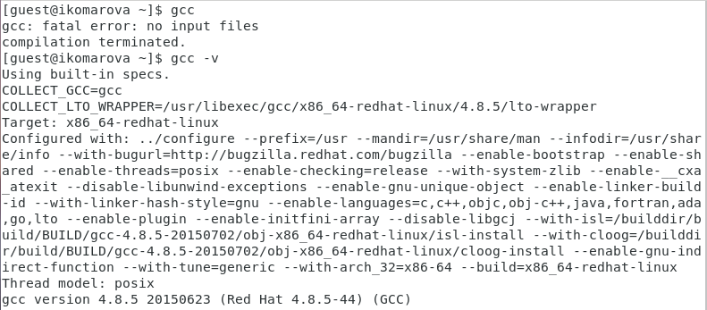
2. Создала программу simpleid.c.
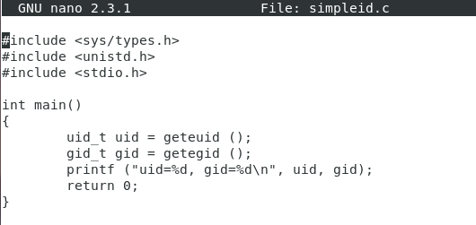
3. Скомплилировала программу и убедилась, что файл программы создан.
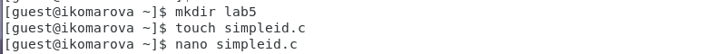
4. Выполнила программу simpleid.
5. Выполните системную программу id.
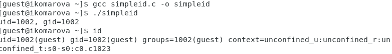
6. Усложнила программу, добавив вывод действительных идентификаторов:
Получившуюся программу назовала simpleid2.c.
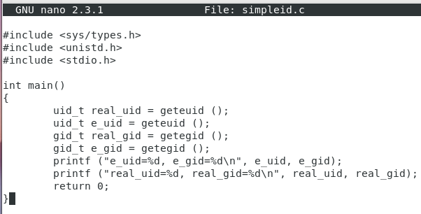
7. Скомпилировала и запустила simpleid2.c:
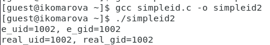
8. От имени суперпользователя выполнила команды:
chown root:guest /home/guest/simpleid2
chmod u+s /home/guest/simpleid2
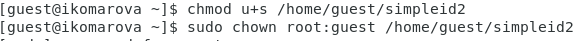
9. Выполнила проверку правильности установки новых атрибутов
10. Выполнла проверку правильности смены владельца файла simpleid2:
ls -l simpleid2
11. Запустила simpleid2 и id:
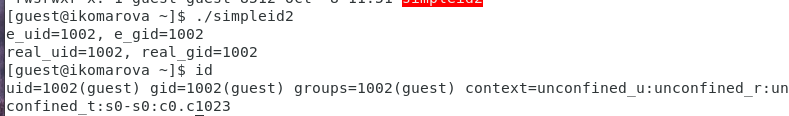
13. Создала программу readfile.c.
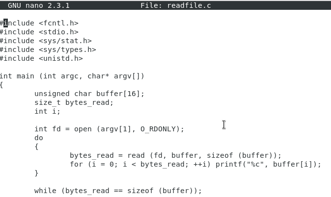
14. Откомпилировалае её.
gcc readfile.c -o readfile
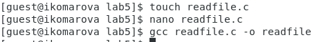
15. Сменила владельца у файла readfile.c (или любого другого текстового
файла в системе) и измените права так, чтобы только суперпользователь
(root) мог прочитать его, a guest не мог.

1. Выясниила, установлен ли атрибут Sticky на директории /tmp, для чего
выполнила команду
ls -l / | grep tmp
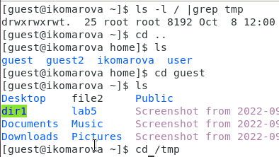
2. От имени пользователя guest создала файл file01.txt в директории /tmp
со словом test:
echo "test" > /tmp/file01.txt
3. Просмотрела атрибуты у только что созданного файла и разрешила чтение и запись для категории пользователей «все остальные»:
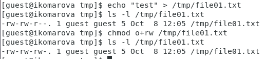
4. От пользователя guest2 (не являющегося владельцем) попробовала прочитать файл /tmp/file01.txt:
cat /tmp/file01.txt
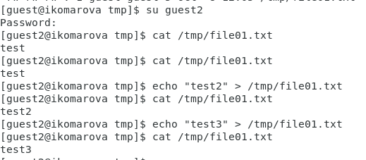
5. От пользователя guest2 попробовала дозаписать в файл
/tmp/file01.txt слово test2 командой
echo "test2" > /tmp/file01.txt
6. Проверила содержимое файла командой
cat /tmp/file01.txt
7. От пользователя guest2 попробовала записать в файл /tmp/file01.txt
слово test3, стерев при этом всю имеющуюся в файле информацию командой
echo "test3" > /tmp/file01.txt
8. Проверила содержимое файла командой
cat /tmp/file01.txt

9. От пользователя guest2 попробуйте удалить файл /tmp/file01.txt командой
rm /tmp/fileOl.txt
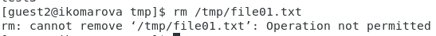
10. Повысила свои права до суперпользователя следующей командой
su -
и выполнитла после этого команду, снимающую атрибут t (Sticky-бит) с
директории /tmp:
chmod -t /tmp
11. Покинула режим суперпользователя командой
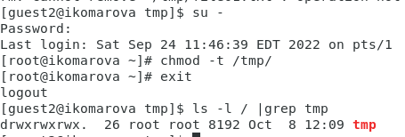
12. От пользователя guest2 проверила, что атрибута t у директории /tmp
нет
13. Повторила предыдущие шаги. К
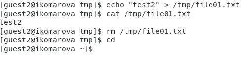
14. Повысила свои права до суперпользователя и вернула атрибут t на директорию /tmp.
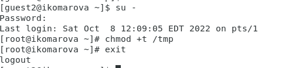

## Вывод 
    Я изучила механизмы зменения идентификаторов, применения SetUID- и Sticky-битов. Получила практические навыки  работы в консоли с дополнительными атрибутами.

## Библиография
1. Методические материалы курса. “Информационная безопасность компьютерных сетей” Кулябов Д. С.,Королькова А. В., Геворкян М. Н.